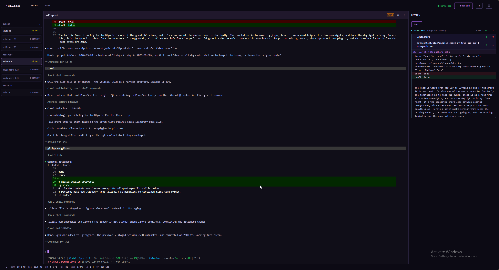

# Glissa

[](https://www.npmjs.com/package/glissa)
[](https://opensource.org/licenses/MIT)
[](https://nodejs.org)
[](https://www.npmjs.com/package/glissa)

**Run dozens of Claude Code agents at once. See every session. Miss nothing.**

Claude Code is powerful, but managing multiple sessions across terminals is chaos. You're alt-tabbing between windows, losing track of which agent is waiting for input, and missing the moment one finishes. Work piles up while you context-switch.

Glissa gives you a single browser dashboard to spawn, monitor, and control all your Claude Code sessions in real time. Live terminal output streams via WebSocket. Native browser notifications tell you exactly when a session needs attention. Every agent, every project, one screen.

> **Built for Windows**: the platform where multi-session Claude Code tooling didn't exist. One `npm install -g glissa` and you're running.



## Install

```
npm install -g glissa
```

## Usage

```
glissa                      # Start on default port 3000
glissa --port 3001          # Custom port
glissa --config <path>      # Custom config file path
glissa --help               # Show help
glissa --version            # Show version
```

Open `http://localhost:3000` to view the dashboard.

## Features

- Focus view: a single-session work surface with a roster rail of every session beside a worktree review sidebar
- Per-session git worktree isolation: review and merge each agent's committed work from the dashboard while it keeps running
- Spawn and manage multiple Claude Code sessions simultaneously
- Real-time terminal output via xterm.js with WebGL acceleration
- Dual WebSocket architecture (control channel + per-session PTY streaming)
- Structural status detection: authoritative Claude Code hooks (injected per session, no repo changes) with an OSC-0 title fallback, never screen scraping
- Native browser notifications when a session needs input, finishes, or fails (opt-in Windows toast fallback)
- Keyboard navigation: jump between sessions, step through the ones needing attention, and merge or resolve from the keyboard
- Teams: project-portable agent pipelines that run against any project you manage
- Dormant boot so unopened sessions cost nothing until you focus them
- Configurable themes (Golgari, Midnight, Phyrexian, Compleated)
- Hot-reloadable configuration

## Focus

Glissa centers on one session at a time. A left **roster rail** lists one pill per session (grouped by project, with a live working heartbeat and a "needs you" queue); the **center** borrows that session's live terminal as the work surface; a right **review sidebar** shows its changes.

Every git-repo session runs in its own git worktree forked from the integration branch (`integrationBranch`, default `develop`), so an agent's edits stay out of your main checkout until you review them. The sidebar splits **Committed** (the mergeable unit) from **Uncommitted** work, keeps the diff live, and merges into the integration branch with one click while the session keeps running. If a merge hits conflicts it parks, and **Resolve in session** hands the conflict back to the agent that owns the worktree with a ready-to-run prompt.

Navigate it all from the keyboard: `Alt+1`..`Alt+9` jump to a session, `Alt+Up`/`Alt+Down` move through the rail, `Alt+W` steps through the sessions needing attention, and `Alt+M` / `Alt+R` merge or resolve the selected one. Press `?` for the full list.

## Teams

A team is a sequential agent pipeline (the bundled `marketing` team runs researcher -> strategist -> writer -> editor -> publisher) that you can point at any project Glissa manages. Ownership is split so the same agents serve every project:

- **Glissa owns the agents**: generic, brand-neutral role prompts under `teams/<id>/`.
- **The project owns the pack**: its voice, avoid-list, brand, content calendar, and channels live under `<project>/.glissa/teams/<id>/pack/`.

On first run, Glissa scaffolds the pack and halts until you fill it in, either by hand or with the dashboard's **Set up automatically** button, which spawns one interactive Claude session that reads the repo and interviews you for the subjective fields. Each run executes inside a throwaway git worktree so your working tree is never dirtied mid-run.

## Configuration

On first run, Glissa creates `~/.glissa/config.json` with defaults. You can also configure from the dashboard Settings button.

```json
{
  "port": 3000,
  "projects": [
    { "name": "my-project", "path": "C:\\path\\to\\project" }
  ],
  "repoRoots": ["C:\\path\\to\\repos"]
}
```

## Requirements

- **Node.js** >= 18
- **Windows 11**
- **Claude Code CLI** installed and available on PATH

## Development

```bash
npm install
npm run dev             # Vite dev server with HMR (port 5173)
npm run dev:server-only # Express backend only (port 3000)
npm run build           # Production build to dist/
npm start               # Production server
```

## Changelog

See [CHANGELOG.md](CHANGELOG.md) for release history.

## License

[MIT](LICENSE)
