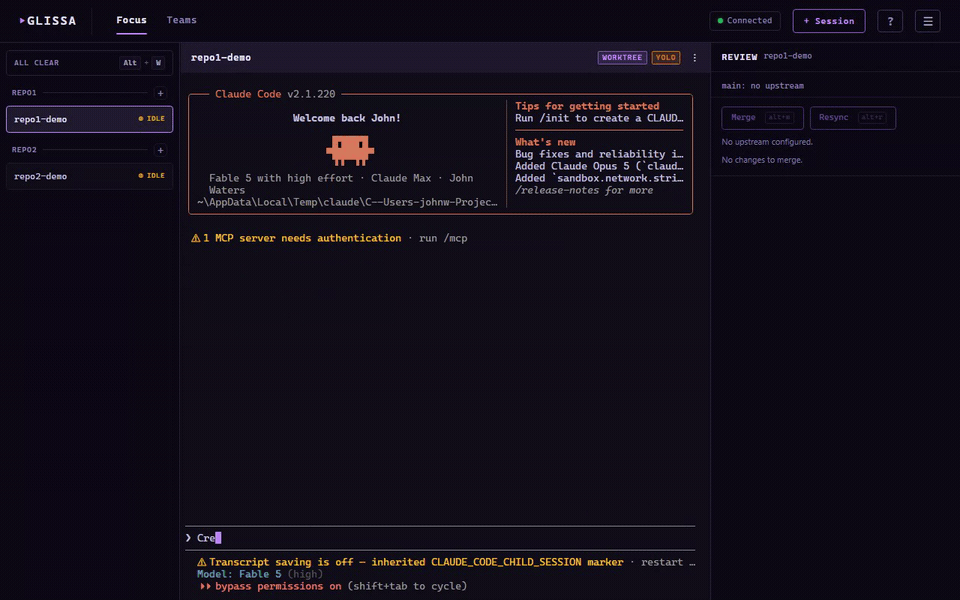
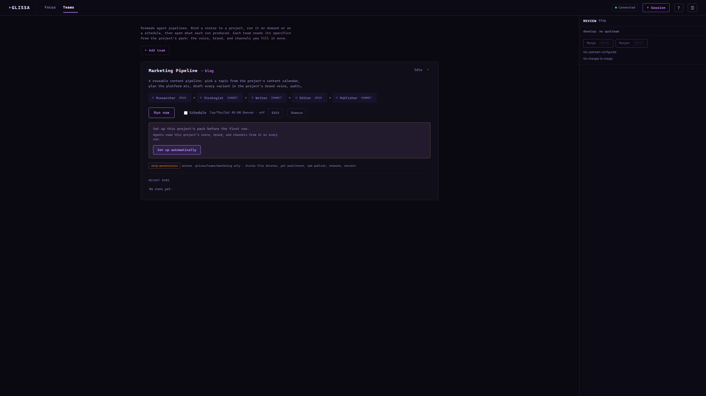

# Glissa

[](https://www.npmjs.com/package/glissa)
[](https://github.com/johncwaters/glissa/actions/workflows/test.yml)
[](https://opensource.org/licenses/MIT)
[](https://nodejs.org)
[](https://www.npmjs.com/package/glissa)

**Run dozens of Claude Code agents at once. See every session. Miss nothing.**

Running more than a couple of Claude Code agents at once turns into alt-tabbing between terminal windows, missing the exact moment one finishes or silently blocks on a prompt, and merging work you never watched happen. Glissa is the shipped fix: one browser dashboard, live terminal output for every session, exact status instead of a guess, and per-agent git worktrees you can review and merge without leaving the page.

It's on npm (`npm install -g glissa`), and I run my daily agent fleet in it. This README was written inside a Glissa session: Glissa is developed inside Glissa.



## Install

```
npm install -g glissa
```

## Usage

```
glissa                      # Start on default port 3000
glissa --port 3001          # Custom port
glissa --config <path>      # Custom config file path
glissa doctor               # Diagnose install / PATH issues
glissa --help               # Show help
glissa --version            # Show version
```

Open `http://localhost:3000` to view the dashboard.

## Troubleshooting

### `glissa` is not recognized after `npm install -g glissa`

The install succeeded, but the directory where npm placed the `glissa` command is not on your PATH (common with a zip/standalone Node, a locked-down corporate image, or pnpm without `pnpm setup`). To fix it:

1. Confirm it installed: `npm ls -g glissa`
2. Find npm's global command directory: `npm config get prefix`. On Windows the command shims (`glissa.cmd`, `glissa.ps1`) live directly in that directory.
3. Make sure that directory is on your PATH. The official Node.js Windows installer adds it for you; if you installed Node from a zip, add it in PowerShell, then open a NEW terminal:

   ```powershell
   [Environment]::SetEnvironmentVariable("PATH", [Environment]::GetEnvironmentVariable("PATH","User") + ";$(npm config get prefix)", "User")
   ```

4. Using pnpm? Run `pnpm setup` once (it configures and registers the global bin directory), then reinstall.
5. Once `glissa` resolves, run `glissa doctor` to confirm PATH, the native module, and the config path are all healthy.

## Features

- Focus view: a single-session work surface with a roster rail of every session beside a worktree review sidebar
- Per-session git worktree isolation: review and merge each agent's committed work from the dashboard while it keeps running
- Spawn and manage multiple Claude Code sessions simultaneously
- Real-time terminal output via xterm.js with WebGL acceleration
- Structural status detection: hooks as the authoritative signal, an OSC-0 title fallback, never screen scraping (see below)
- Background sub-agent completion gate: a session with live background agents or tasks stays out of Complete until they finish
- Native browser notifications when a session needs input, finishes, or fails (opt-in Windows toast fallback)
- Keyboard navigation: jump between sessions, step through the ones needing attention, and merge or resolve from the keyboard
- Teams: project-portable agent pipelines that run against any project you manage
- GitHub PR auto-review (opt-in): reviews your own open PRs headlessly, comments its findings, and auto-merges only the clean PRs whose checks are green
- Auto-resume by default: sessions that were live when Glissa stopped come back on the next start with their Claude conversation resumed
- Configurable themes, hot-reloadable configuration

## Why the status detection is hard (and how Glissa does it)

The obvious way to know if a Claude Code session finished, is waiting on you, or is still working is to scrape the terminal: watch for a prompt string, a spinner glyph, some text pattern. It breaks constantly. Every TUI redraw, every theme change, every Claude Code release that adjusts spacing invalidates the scrape. Glissa never does this.

Instead, at spawn Glissa injects Claude Code hooks scoped to that one session, no changes to the target repo, that POST to a local HTTP endpoint on every lifecycle event: prompt submitted, turn stopped, notification raised, sub-agent started or finished. These hooks are the authoritative signal. An OSC-0 terminal title fallback (braille spinner glyph = working, idle glyph = ready) covers the gap for anything that predates or bypasses the hooks. The two are merged with explicit precedence (hook beats title) and a short conflict window so a racing signal can still win before the UI settles.

That design didn't arrive whole. Three incidents shaped it:

`/clear` and `/compact` fire no `UserPromptSubmit` and no `Stop`, but the terminal redraw briefly flashes a spinner then an idle glyph in the title. Early on, that flash looked exactly like a finished work cycle, so Glissa fired a "session complete" notification on every `/clear`. (The bug report was, more or less, "why did my terminal congratulate me for clearing the screen.") The fix: on a detected clear/compact, reset both signal sources and mute title-only signals until the next real prompt.

A background sub-agent (launched via `Task` with `run_in_background`, or Ctrl+B) can still be running when the main agent's own turn ends and its `Stop` hook fires. Treating that `Stop` as completion closed the card while real work was still happening in the background. The fix is a completion gate: Glissa counts live sub-agents from `SubagentStart`/`SubagentStop` and reconciles that count against `background_tasks`, a field Claude Code's own hook payloads declare independently. Staleness between the two is resolved by a sequence number, not a timestamp, because concurrent signals routinely land in the same millisecond.

Boot auto-resume (reattaching a session's Claude conversation after Glissa restarts) depends on capturing Claude's session id from a hook. It was wired to capture that id from `SessionStart`, which seemed reasonable until testing showed Claude Code doesn't reliably fire `SessionStart` on interactive startup at all, silently dead in production, no error, resume just never happened. The fix: capture the session id from whichever main-agent hook arrives first, since they all carry it.

Every session also writes a JSONL forensic recording by default (hook payloads and state transitions, not raw terminal bytes), and a version-aware replay harness drives recorded traffic back through the detection code as regression fixtures. That's how bugs like the ones above get diagnosed from real session data instead of guesswork, and how they stay caught if the logic regresses.

## Engineering notes

- Pure-core seam architecture: IO-free decision logic lives in `session/core/` and `*-core.mjs` modules; thin shells around them do the actual I/O.
- `node:test` suite in `tests/`, zero test-framework dependency.
- Table-driven state machines, e.g. `session/core/state-machine.js`.
- Fail-closed PR auto-review merge gate: `server/core/pr-review-core.js` only merges a clean, non-stale, green-checks PR; anything ambiguous (no checks, a `gh` error, a touched workflow file) blocks instead of guessing.
- Bounded-retention session recorder: `session/session-recorder.js`, capped by file size, file count, and age so it can run unattended indefinitely.

## Focus

Glissa centers on one session at a time. A left **roster rail** lists one pill per session (grouped by project, with a live working heartbeat and a "needs you" queue); the **center** borrows that session's live terminal as the work surface; a right **review sidebar** shows its changes.

Every git-repo session runs in its own git worktree forked from the integration branch (`integrationBranch`, default `develop`), so an agent's edits stay out of your main checkout until you review them. The sidebar splits **Committed** (the mergeable unit) from **Uncommitted** work, keeps the diff live, and merges into the integration branch with one click while the session keeps running. If a merge hits conflicts it parks, and **Resolve in session** hands the conflict back to the agent that owns the worktree with a ready-to-run prompt.

Navigate it all from the keyboard: `Alt+1`..`Alt+9` jump to a session, `Alt+Up`/`Alt+Down` move through the rail, `Alt+W` steps through the sessions needing attention, and `Alt+M` / `Alt+R` merge or resolve the selected one. Press `?` for the full list.

## Teams

A team is a sequential agent pipeline that you can point at any project Glissa manages. Three ship with Glissa:

- **marketing**: researcher -> strategist -> writer -> editor -> publisher. Drafts content in the project's brand voice and, on a SHIP verdict, queues approved posts to Postiz as drafts.
- **changelog**: analyst -> curator -> auditor -> announcer. Reconciles `CHANGELOG.md` against git history, then drafts a release announcement in the project's voice.
- **qa**: runner-triager -> fixer -> auditor -> reporter. A regression auto-fixer: it keeps the existing test suite green by fixing source, never the tests.

Ownership is split so the same agents serve every project:

- **Glissa owns the agents**: generic, brand-neutral role prompts under `teams/<id>/`, composed from reusable blocks in `teams/_shared/` where possible.
- **The project owns the pack**: its voice, avoid-list, brand, content calendar, and channels live under `<project>/.glissa/teams/<id>/pack/`. A subset of those files (voice-guide, avoid-list, brand) is project-level shared, filled once under `<project>/.glissa/pack/` and reused by every team that declares them, instead of being re-interviewed and duplicated per team.

On first run, Glissa scaffolds the pack and halts until you fill it in, either by hand or with the dashboard's **Set up automatically** button, which spawns one interactive Claude session that reads the repo and interviews you for the subjective fields. Each run executes inside a throwaway git worktree so your working tree is never dirtied mid-run. A verdict stage (SHIP / FIX / BLOCK) can trigger a bounded FIX revision loop: earlier stages re-run with the reviewer's notes and the audit repeats, up to a capped number of rounds, before the run finalizes.



## Configuration

On first run, Glissa creates `~/.glissa/config.json` with defaults. You can also configure from the dashboard Settings button.

```json
{
  "port": 3000,
  "projects": [
    { "name": "my-project", "path": "C:\\path\\to\\project" }
  ],
  "repoRoots": ["C:\\path\\to\\repos"]
}
```

This is a minimal starting example. The full key list (`integrationBranch`, `autoResume`, `prReview`, `detectBackgroundAgents`, `recordSignals`, and more) is documented in the dashboard's Settings dialog and can also be edited directly in `config.json`.

## Requirements

- **Node.js** >= 18
- **Windows 11**
- **Claude Code CLI** installed and available on PATH

## Development

```bash
npm install
npm run dev             # Vite dev server with HMR (port 5173)
npm run dev:server-only # Express backend only (port 3000)
npm run build           # Production build to dist/
npm start               # Production server
```

`tests/` is the automated `node:test` suite (`npm test`). `test/` holds manual smoke scripts, run by hand, not part of CI.

## Limitations

- **Windows 11 only.** Built for the platform where multi-session Claude Code tooling didn't exist. Other platforms are untested, not merely unsupported in the docs.
- **Localhost-only, single-user trust boundary.** Neither WebSocket channel has authentication; any local process can connect. That's a deliberate scope choice for a single-user dev tool, not an oversight, but it means the port must never be exposed beyond `localhost`.
- **Requires the Claude Code CLI.** Glissa spawns and manages it; it doesn't replace it.

## Changelog

See [CHANGELOG.md](CHANGELOG.md) for release history.

## License

[MIT](LICENSE)
